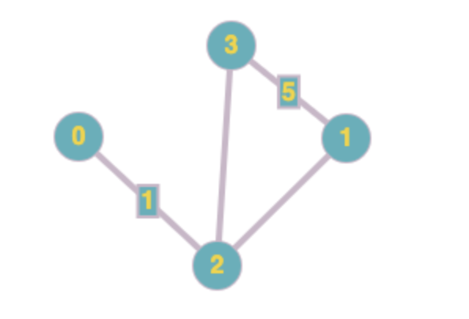
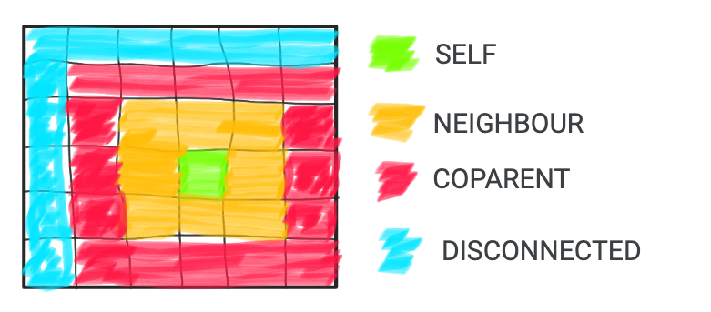

# A Graph Based Implementation of the Game of Life

This is an implementation of the Game of Life where living cells and their relationships with each other are stored in a graph. Each node of the graph represents a cell, while the edges of the graph represent the relationship each living cell has with the others.

###  What is a graph?
A graph is an abstract data-type meant to represent a group of things and their relationships with each other. Each "Thing" in a graph is referred to as a "node" or "vertex" and the relationships between the nodes of a graph are referred to as "edges". In general, when they are drawn, vertices are represented as circles connected by lines (which represent the edges). 

In the graph representation below, the the nodes are the circled integers 0,1,2 and 3. The edges are the lines in between the nodes. 

Edges may be assigned a value or not. If an edge is labeled with a value, we describe that value as the edge's weight. An edge's weight provides information about the relationship that exists between the two nodes it joins. This information could be the distance between two points, or the type of connection. Although the sample graph uses numbers, nodes and edges can be represented by anything. They may be booleans, strings, or even objects! 

Graphs may be represented by several data structures in code. The most popular ways to represent a graph are either with an [adjacency matrix](https://en.wikipedia.org/wiki/Adjacency_matrix#:~:text=In%20graph%20theory%20and%20computer,with%20zeros%20on%20its%20diagonal.) or [adjacency list](https://en.wikipedia.org/wiki/Adjacency_list#:~:text=In%20graph%20theory%20and%20computer,for%20use%20in%20computer%20programs.).

### The nodes and edges in my Game of Life

In this implementation of the game of life, I am representing each living cell as a node on a connected graph. When a graph is connected, this means that each node of the graph has an edge linking it to every other node on the graph. This connectedness of my graph may change, as I am iterating on the actual algorithm as I go.

The edges on my graph are the type of relationship that exists between two nodes or cells. There are 4 relationship types that could connect a cell with other cells in this graph:

- __SELF__: Represents the cell itself
- __NEIGHBOUR__: In the visual representation of the Game of Life, this is a cell in the Moore Neighbourhood immediately surrounding the 'SELF' cell. These cells influence whether the 'SELF' cell survives to the next turn.
- __COPARENT__: A cell that can work in conjunction with the self cell to create new life. These cells can either also be NEIGHBOURS, or they can be part of the group of cells immediately surrounding the neighbours.
- __DISCONNECTED__: A cell that has no impact on the SELF cell at all. It's too far away.

## Why?

There are many better graph-based implementations of the Game of Life. [This one](https://demonstrations.wolfram.com/VisualizingConwaysGameOfLife/) and [this one](https://en.wikipedia.org/wiki/Hashlife) are pretty cool examples. So why did I want to do it this way? What did I want to learn?

Ever since the second coderetreat I'd hosted a year ago, implementing the game of life by imagining storing the living cells in a graph has been bugging me. Since this has been a two year-long brain worm, I decided it would be worth actually coding it out. So I did. Just because I wanted to.

I am writing this from a learning perspective where I am intentionally trying to do things "right" and take it slow. Because I am taking my time, and not pressuring myself to do anything but learn and solve the problem, this became my project to "just code". It's something that reminds me why I love doing what I do.

## What did I learn?

There's really no point in doing a learning project unless I can record my learnings somewhere I can check back on them. During this project, I learned quite a bit about the Game of Life algorithm. I also started writing my tests with a new tool, [Approval Tests](https://github.com/approvals/approvaltests.java). I'm writing up my learnings in this repo so I can check back on them later.

Here is where I'm storing that information:
- [Approvals](learnings/Approvals.md)
- [Game of Life Algorithm](learnings/GameOfLifeAlgorithm.md)
